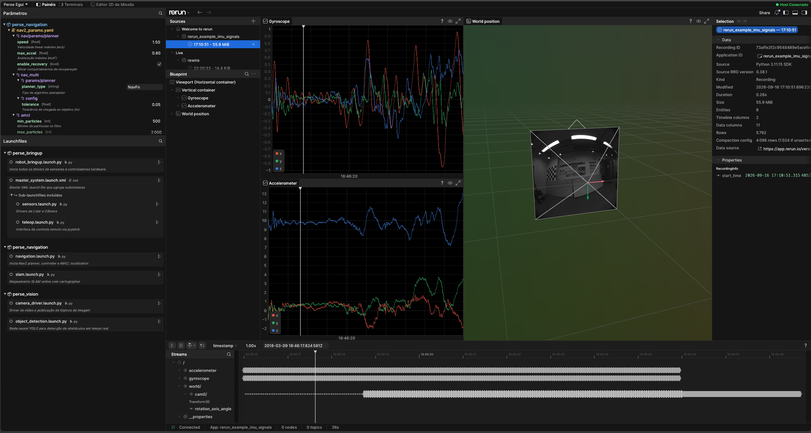
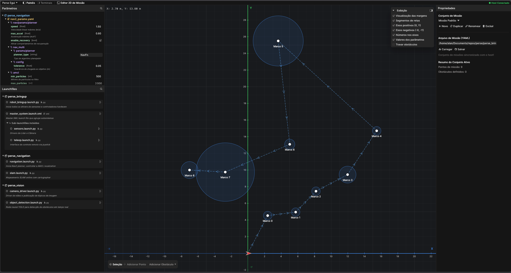

<h1 align="center">
    perse_egui - ThundeRatz Trekking
</h1>

<p align="center">


</p>

<p align="center">


</p>

O **perse_egui** é a interface gráfica de controle, telemetria, diagnóstico e planejamento de missões desenvolvida para o robô autônomo **Perse**, competidor da categoria **Trekking** pela equipe **ThundeRatz**.

O projeto reúne, em uma única aplicação acelerada por hardware (nativa e WebAssembly):
- **Visualizador 3D/2D (Rewire / Rerun Viewer)**: monitoramento em tempo real de sensores (câmera OAK-D, LIDAR), odometria, mapas e transformadas (TF) através de conexão com o relay rewire.
- **Editor 2D de Missões**: planejamento e ajuste de trajetórias em campo gramado, posicionamento de marcos (waypoints) com atributos de controle (velocidades, margens, desvio de cone) e delimitação de obstáculos.
- **Painéis de Controle Remoto**: gerenciamento de parâmetros ROS 2 em tempo real, inicialização/interrupção de launchfiles e monitoramento de terminais no robô.

<p align="center">
  
  
</p>

---

## :sparkles: Funcionalidades

### 🎯 Editor de Missões 2D
- **Criação e Edição de Marcos**: adicione pontos de navegação clicando no plano cartesiano, ajuste coordenadas, velocidades de odometria/visão e margens de aceitação.
- **Obstáculos Geométricos**: suporte a polígonos, linhas, retângulos e círculos (físicos ou cosméticos).
- **Múltiplos Conjuntos de Missão**: crie, duplique, renomeie e alterne entre diferentes estratégias de pista sem sobrescrever arquivos.
- **Persistência Completa**: salvamento em formato padrão YAML (`mission_points.yaml`) compatível com os nós de navegação do robô e sincronização contínua via WebSocket.
- **Atalhos Rápidos**: suporte a `Ctrl + S` para salvar, `Delete` / `Backspace` para exclusão e arrasto interativo de pontos.

### 👁️ Visualizador Rewire / Rerun Integrado
- Conexão direta com streams gRPC/HTTP do rewire.
- Visualização de nuvens de pontos, mapas de ocupação, poses do robô e imagens da câmera estéreo.

### ⚙️ Painel de Parâmetros
- Navegação em árvore por pacotes e nós do ROS 2.
- Edição de valores numéricos, booleanos e strings com botão de aplicação remota (`apply_params`).

### 🚀 Launchfiles & Terminais
- Listagem remota dos launchfiles disponíveis na workspace do robô.
- Início e parada de rotinas com indicação de status em tempo real.
- Visualização e envio de comandos aos terminais remotos do robô.

---

## :globe_with_meridians: Modos de Operação

O **perse_egui** foi projetado para rodar em duas arquiteturas complementares:

1. **Modo Nativo (Desktop)**: Executável compilado para Linux/macOS/Windows com aceleração WGPU. Ideal para desenvolvimento local na estação de trabalho ou controle de campo com baixa latência.
2. **Modo Web & Daemon (No Robô / Navegador)**: O robô executa o binário com a flag `--daemon`. Ele disponibiliza um servidor HTTP/WebSocket com proxy reverso e serve a interface WebAssembly para que qualquer dispositivo (computador, tablet ou celular conectado à rede do robô) acesse o painel sem instalar dependências.

---

## :wrench: Pré-requisitos

### Compilação Nativa (Rust)
Para compilar o projeto diretamente pelo Rust, instale a toolchain oficial:

```bash
curl --proto '=https' --tlsv1.2 -sSf https://sh.rustup.rs | sh
source $HOME/.cargo/env
```

Dependências de sistema para o backend gráfico no Ubuntu/Debian:
```bash
sudo apt update && sudo apt install -y \
    libclang-dev \
    libssl-dev \
    libxcb-render0-dev \
    libxcb-shape0-dev \
    libxcb-xfixes0-dev \
    libxkbcommon-dev \
    libasound2-dev \
    libfontconfig1-dev \
    libudev-dev
```

### Compilação WebAssembly
Caso deseje gerar os artefatos WebAssembly otimizados para o navegador, instale o target `wasm32`, o utilitário `wasm-bindgen-cli` e o `wasm-opt`:

```bash
rustup target add wasm32-unknown-unknown
cargo install -f wasm-bindgen-cli
# wasm-opt é instalado automaticamente pelo script build_web.sh via cargo-binstall caso não esteja presente
```

---

## :hammer_and_wrench: Makefile e Automação

O projeto inclui um `Makefile` completo para facilitar o fluxo de build, download de binários no robô e configuração de serviços:

```bash
make help          # Exibe todos os comandos disponíveis
make build         # Compila o binário nativo com Cargo
make build-daemon  # Compila apenas o binário headless daemon (sem GUI nativa, muito rápido)
make build-web     # Compila os artefatos WebAssembly (web/)
make all           # Compila nativo + web
```

---

## :robot: Instalação no Robô (Jetson / Sem Cargo)

No robô (Nvidia Jetson / arquitetura `aarch64`), a compilação do Rust e suas dependências gráficas (`eframe`, `wgpu`, `rewire-viewer`) pode consumir muita memória RAM e espaço em disco. Para contornar isso, o projeto disponibiliza binários pré-compilados nas Releases do GitHub.

### Opção A: Instalação Rápida via Makefile (Recomendado no Robô)

O `Makefile` detecta automaticamente a arquitetura do robô (`aarch64` ou `x86_64`) e baixa os binários e os artefatos WebAssembly sem precisar do Cargo:

```bash
# 1. Baixar o binário da arquitetura e o pacote WebAssembly (web/)
make download

# 2. Instalar no sistema (/usr/local/bin e /usr/local/share)
sudo make install

# Ou instalar apenas para o usuário atual (~/.local/bin):
make install-user
```

### Opção B: Serviço do Sistema (Systemd no Robô)

Para que o robô suba o servidor web/daemon automaticamente na inicialização:

```bash
# Cria o arquivo /etc/systemd/system/perse_egui.service
make service

# Ativar e iniciar o serviço
sudo systemctl enable --now perse_egui

# Verificar status
sudo systemctl status perse_egui
```

---

## :package: Integração com ROS 2 (Colcon)

O `perse_egui` é estruturado como um pacote ROS 2 `ament_cmake`. Ele pode ser clonado dentro da sua workspace (`perse_ws/src/perse_egui`).

### 1. Compilando com Cargo (Desktop / Estação de Desenvolvimento)

Se o `cargo` estiver instalado, o `colcon build` compilará o pacote normalmente:

```bash
colcon build --packages-select perse_egui
source install/setup.bash
```

> **Dica para computadores com pouca RAM**: limite a quantidade de jobs de compilação:
> ```bash
> colcon build --packages-select perse_egui --cmake-args -DCMAKE_BUILD_PARALLEL_LEVEL=2
> ```

### 2. No Robô sem Cargo ou Forçando Binário Pré-Compilado

Se o `cargo` **não** estiver instalado no robô, o `CMakeLists.txt` detecta automaticamente e realiza o download do binário correspondente e do tarball WebAssembly durante o `colcon build`.

Caso queira forçar o download mesmo se tiver cargo instalado:

```bash
colcon build --packages-select perse_egui --cmake-args -DPERSE_DOWNLOAD_PREBUILT=ON
source install/setup.bash
```

Caso prefira compilar no robô apenas a versão headless/daemon (sem GUI nativa, muito mais rápida e leve):

```bash
colcon build --packages-select perse_egui --cmake-args -DPERSE_BUILD_DAEMON_ONLY=ON
source install/setup.bash
```

---

## :rocket: Como Executar

### 1. Aplicação Nativa (Desktop)

Para executar a interface nativa conectando-se ao rewire local:

```bash
# Via Makefile:
make run

# Ou via Cargo:
cargo run --release

# Conectando a um robô remoto (ex: Jetson no IP 192.168.0.100):
cargo run --release -- --connect 192.168.0.100:9876
```

### 2. Modo Daemon no Robô (Servidor Web & Proxy)

No robô, inicie o `perse_egui` como daemon para disponibilizar o painel no navegador:

```bash
# Via Makefile:
make daemon PORT=8080 CONNECT=127.0.0.1:9876

# Ou diretamente pelo executável instalado:
perse_egui --daemon --port 8080 --connect 127.0.0.1:9876

# Ou via ROS 2 launch:
ros2 launch perse_egui perse_egui.launch daemon:=true port:=8080
```

Quando o daemon está rodando:
- A interface WebAssembly é servida em `http://<IP_DO_ROBO>:8080`.
- O endpoint WebSocket de controle (`/ws/control`) sincroniza missões, terminais, parâmetros e launchfiles em tempo real.
- O proxy reverso integrado (`/proxy`) repassa streams de vídeo e mensagens gRPC para o `rewire`.
- O diretório dos arquivos web é resolvido automaticamente em:
  1. Argumento CLI `--web-dir <CAMINHO>`
  2. Variável de ambiente `PERSE_WEB_DIR`
  3. `./web` (diretório local de execução)
  4. `<caminho_do_executável>/web`
  5. `<prefixo>/share/perse_egui/web` (instalação padrão do sistema/ROS 2)

---

## :floppy_disk: Persistência de Dados

- **Arquivo YAML da Missão**: o arquivo configurado no campo de texto (padrão: `mission_points.yaml`) contém a lista de pontos e obstáculos no formato aceito pelo robô.
- **Coleção de Conjuntos (`mission_sets.json`)**: armazena todos os conjuntos de missões criados, duplicados e renomeados no editor, garantindo que nenhum histórico seja perdido ao fechar o programa ou reiniciar o robô.
- **Storage da Aplicação**: preferências como largura das barras laterais, zoom, tema e opções de visibilidade da grade/margens são mantidas automaticamente pelo `eframe` nativo e pelo `localStorage` do navegador.
